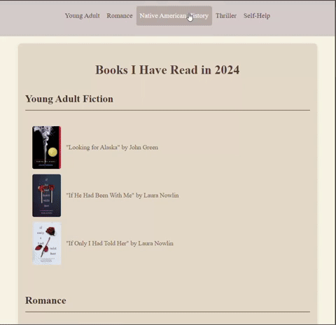

# books-read

## Introduction
As part of my New Year's resolution for 2024, I set out to read 10 books. So far, I've surpassed that goal and have read 20 books this year! Now, I'm on the hunt for new recommendations to expand my reading list.

The purpose of this webpage is to showcase the books I’ve read this year and to invite visitors to recommend books they enjoyed. Your suggestions are greatly appreciated, and I can’t wait to explore new stories based on your recommendations! You can also visit my other website, the [**Book Survey Form**](https://rbracker.github.io/book-survey/), linked at the bottom of my Books I Have Read webpage to share your favorite reads!

Thank you in advance for your time and thoughtfulness!

## Website Preview

Below is a video preview showcasing the design and functionality of my [**Books I Have Read in 2024**](yourwebsiteurl.com) website:

The website features a cozy, brown-toned theme, offering a visually pleasing and comfortable experience. This design is meant to create a warm atmosphere for users as they explore my reading list.

## Features
- **Responsive Design**: The layout adjusts beautifully on both mobile and desktop devices.
- **Genre Categorization**: Books are organized by genre for easy navigation.
- **Interactive Links**: Each book has a cover image and a direct link to purchase it.
- **Custom Theme**: A cozy theme that enhances the reading experience.

## How to Use
1. Visit the [Books I Have Read in 2024](yourwebsiteurl.com).
2. Navigate through the genres using the menu at the top.
3. Click on any book title or cover to view its purchase link.
4. Enjoy exploring the curated list of books!

## Contributions
Feel free to contribute to this project! Whether it’s improving the design, adding features, or fixing bugs, all contributions are welcome. Fork the repo and submit a pull request to get started.

## License
This project is licensed under the MIT License - see the [LICENSE.md](LICENSE.md) file for details.
